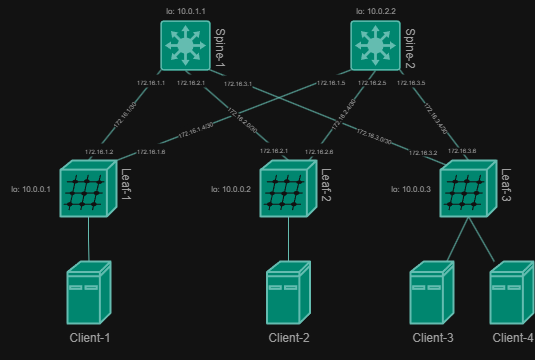

# Построение Underlay сети(OSPF)

### Цели:
- ##### Настроить OSPF для Underlay сети.

### Описание/Пошаговая инструкция выполнения домашнего задания:
- ##### Настроите OSPF в Underlay сети, для IP связанности между всеми сетевыми устройствами.
- ##### Зафиксируете в документации - план работы, адресное пространство, схему сети, конфигурацию устройств
- ##### Убедитесь в наличии IP связанности между устройствами в OSFP домене



### Для IPv4
#### Адреса loopback-интерфейсов 
| Узел | Loopback-адрес |
|---------|--------|
| Spine-1 | 10.0.1.1 |
| Spine-2 | 10.0.2.2 |
| Leaf-1 | 10.0.0.1 |
| Leaf-2 | 10.0.0.2 |
| Leaf-3 | 10.0.0.3 |

##### Общая таблица связей:
| Связь | Подсеть | Адрес на Spine           | Адрес на Leaf           |
|---------------|---------------|---------------|---------------|
| Spine-1 <-> Leaf-1 | 172.16.1.0/30 | 172.16.1.1 | 172.16.1.2 |
| Spine-1 <-> Leaf-2 | 172.16.2.0/30 | 172.16.2.1 | 172.16.2.2 |
| Spine-1 <-> Leaf-3 | 172.16.3.0/30 | 172.16.3.1 | 172.16.3.2 |
| Spine-2 <-> Leaf-1 | 172.16.1.4/30 | 172.16.1.5 | 172.16.1.6 |
| Spine-2 <-> Leaf-2 | 172.16.2.4/30 | 172.16.2.5 | 172.16.2.6 |
| Spine-2 <-> Leaf-3 | 172.16.3.4/30 | 172.16.3.5 | 172.16.3.6 |

### Для IPv6
##### Адреса loopback-интерфейсов 
| Узел | Loopback-адрес |
|---------|--------|
| Spine-1	| 2001:db8:fab:ffff::1/128 |
| Spine-2   | 2001:db8:fab:ffff::2/128 |
| Leaf-1	| 2001:db8:fab:ffff::101/128 |
| Leaf-2	| 2001:db8:fab:ffff::102/128 |
| Leaf-3	| 2001:db8:fab:ffff::103/128 |

##### Общая таблица связей:
| Связь         | Подсеть                     | Адрес на Spine           | Адрес на Leaf           |
|---------------|-----------------------------|--------------------------|-------------------------|
| Spine1 <-> Leaf1  | 2001:db8:acad:1001::/64    | 2001:db8:acad:1001::1   | 2001:db8:acad:1001::2  |
| Spine1 <-> Leaf2  | 2001:db8:acad:1002::/64    | 2001:db8:acad:1002::1   | 2001:db8:acad:1002::2  |
| Spine1 <-> Leaf3  | 2001:db8:acad:1003::/64    | 2001:db8:acad:1003::1   | 2001:db8:acad:1003::2  |
| Spine2 <-> Leaf1  | 2001:db8:acad:2001::/64    | 2001:db8:acad:2001::1   | 2001:db8:acad:2001::2  |
| Spine2 <-> Leaf2  | 2001:db8:acad:2002::/64    | 2001:db8:acad:2002::1   | 2001:db8:acad:2002::2  |
| Spine2 <-> Leaf3  | 2001:db8:acad:2003::/64    | 2001:db8:acad:2003::1   | 2001:db8:acad:2003::2  |

##### Пример настроек:

Spine-1:
```cfg
ip routing
ipv6 unicast-routing

router ospf 1
   area 0.0.0.1 stub no-summary
   router-id 10.0.1.1
   max-lsa 12000

ipv6 router ospf 1
   router-id 10.0.1.1
   area 0.0.0.1 stub no-summary

int e1
   ip ospf network point-to-point
   ip ospf area 0.0.0.1
   ipv6 ospf network point-to-point
   ipv6 ospf 1 area 0.0.0.1
int e2
   ip ospf network point-to-point
   ip ospf area 0.0.0.1
   ipv6 ospf network point-to-point
   ipv6 ospf 1 area 0.0.0.1
int e3
   ip ospf network point-to-point
   ip ospf area 0.0.0.1
   ipv6 ospf network point-to-point
   ipv6 ospf 1 area 0.0.0.1
int lo0
   ip ospf network point-to-point
   ip ospf area 0.0.0.1
   ipv6 ospf network point-to-point
   ipv6 ospf 1 area 0.0.0.1

```

Leaf-1:
```cfg
ip routing
ipv6 unicast-routing

router ospf 1
   router-id 10.0.0.1
   area 0.0.0.1 stub
   max-lsa 12000


ipv6 router ospf 1
   router-id 10.0.0.1
   area 0.0.0.1 stub

int e1
   ip ospf network point-to-point
   ip ospf area 0.0.0.1
   ipv6 ospf network point-to-point
   ipv6 ospf 1 area 0.0.0.1
int e2
   ip ospf network point-to-point
   ip ospf area 0.0.0.1
   ipv6 ospf network point-to-point
   ipv6 ospf 1 area 0.0.0.1
int lo0
   ip ospf network point-to-point
   ip ospf area 0.0.0.1
   ipv6 ospf network point-to-point
   ipv6 ospf 1 area 0.0.0.1


```

#### Проверка

##### IPv4
SH IP RO:
```cfg
Spine-1#sh ip ro

VRF: default
Codes: C - connected, S - static, K - kernel, 
       O - OSPF, IA - OSPF inter area, E1 - OSPF external type 1,
       E2 - OSPF external type 2, N1 - OSPF NSSA external type 1,
       N2 - OSPF NSSA external type2, B - Other BGP Routes,
       B I - iBGP, B E - eBGP, R - RIP, I L1 - IS-IS level 1,
       I L2 - IS-IS level 2, O3 - OSPFv3, A B - BGP Aggregate,
       A O - OSPF Summary, NG - Nexthop Group Static Route,
       V - VXLAN Control Service, M - Martian,
       DH - DHCP client installed default route,
       DP - Dynamic Policy Route, L - VRF Leaked,
       G  - gRIBI, RC - Route Cache Route

Gateway of last resort is not set

 O        10.0.0.1/32 [110/20] via 172.16.1.2, Ethernet1
 O        10.0.0.2/32 [110/20] via 172.16.2.2, Ethernet2
 O        10.0.0.3/32 [110/20] via 172.16.3.2, Ethernet3
 C        10.0.1.1/32 is directly connected, Loopback0
 O        10.0.2.2/32 [110/30] via 172.16.1.2, Ethernet1
                               via 172.16.2.2, Ethernet2
                               via 172.16.3.2, Ethernet3
 C        172.16.1.0/30 is directly connected, Ethernet1
 O        172.16.1.4/30 [110/20] via 172.16.1.2, Ethernet1
 C        172.16.2.0/30 is directly connected, Ethernet2
 O        172.16.2.4/30 [110/20] via 172.16.2.2, Ethernet2
 C        172.16.3.0/30 is directly connected, Ethernet3
 O        172.16.3.4/30 [110/20] via 172.16.3.2, Ethernet3
```

PING:
```cfg
Spine-1#ping 10.0.0.1
PING 10.0.0.1 (10.0.0.1) 72(100) bytes of data.
80 bytes from 10.0.0.1: icmp_seq=1 ttl=64 time=12.2 ms
80 bytes from 10.0.0.1: icmp_seq=2 ttl=64 time=14.7 ms
80 bytes from 10.0.0.1: icmp_seq=3 ttl=64 time=10.9 ms
80 bytes from 10.0.0.1: icmp_seq=4 ttl=64 time=8.40 ms

--- 10.0.0.1 ping statistics ---
5 packets transmitted, 4 received, 20% packet loss, time 57ms
rtt min/avg/max/mdev = 8.409/11.602/14.799/2.316 ms, pipe 2, ipg/ewma 14.449/11.899 ms
Spine-1#ping 10.0.0.2
PING 10.0.0.2 (10.0.0.2) 72(100) bytes of data.
80 bytes from 10.0.0.2: icmp_seq=1 ttl=64 time=10.9 ms
80 bytes from 10.0.0.2: icmp_seq=2 ttl=64 time=8.79 ms
80 bytes from 10.0.0.2: icmp_seq=3 ttl=64 time=7.63 ms
80 bytes from 10.0.0.2: icmp_seq=4 ttl=64 time=11.9 ms
80 bytes from 10.0.0.2: icmp_seq=5 ttl=64 time=15.1 ms

--- 10.0.0.2 ping statistics ---
5 packets transmitted, 5 received, 0% packet loss, time 47ms
rtt min/avg/max/mdev = 7.634/10.896/15.176/2.623 ms, pipe 2, ipg/ewma 11.944/11.089 ms
Spine-1#ping 10.0.0.3
PING 10.0.0.3 (10.0.0.3) 72(100) bytes of data.
80 bytes from 10.0.0.3: icmp_seq=1 ttl=64 time=11.7 ms
80 bytes from 10.0.0.3: icmp_seq=2 ttl=64 time=16.2 ms
80 bytes from 10.0.0.3: icmp_seq=3 ttl=64 time=10.4 ms
80 bytes from 10.0.0.3: icmp_seq=4 ttl=64 time=8.25 ms
80 bytes from 10.0.0.3: icmp_seq=5 ttl=64 time=10.5 ms

--- 10.0.0.3 ping statistics ---
5 packets transmitted, 5 received, 0% packet loss, time 63ms
rtt min/avg/max/mdev = 8.259/11.463/16.282/2.662 ms, ipg/ewma 15.936/11.479 ms
Spine-1#ping 10.0.2.2
PING 10.0.2.2 (10.0.2.2) 72(100) bytes of data.
80 bytes from 10.0.2.2: icmp_seq=1 ttl=63 time=36.5 ms
80 bytes from 10.0.2.2: icmp_seq=2 ttl=63 time=28.4 ms
80 bytes from 10.0.2.2: icmp_seq=3 ttl=63 time=23.7 ms
80 bytes from 10.0.2.2: icmp_seq=4 ttl=63 time=16.5 ms
80 bytes from 10.0.2.2: icmp_seq=5 ttl=63 time=16.1 ms

--- 10.0.2.2 ping statistics ---
5 packets transmitted, 5 received, 0% packet loss, time 100ms
rtt min/avg/max/mdev = 16.198/24.311/36.590/7.674 ms, pipe 3, ipg/ewma 25.119/29.940 ms
```
##### IPv6
SH IPv6 RO OS
```cfg
Spine-1#sh ipv6 route ospf 

VRF: default
Displaying 7 of 18 IPv6 routing table entries
Codes: C - connected, S - static, K - kernel, O3 - OSPFv3,
       B - Other BGP Routes, A B - BGP Aggregate, R - RIP,
       I L1 - IS-IS level 1, I L2 - IS-IS level 2, DH - DHCP,
       NG - Nexthop Group Static Route, M - Martian,
       DP - Dynamic Policy Route, L - VRF Leaked,
       RC - Route Cache Route

 O3       2001:db8:fab:2001::/64 [110/20]
           via fe80::5200:ff:fecb:38c2, Ethernet1
 O3       2001:db8:fab:2002::/64 [110/20]
           via fe80::5200:ff:fe15:f4e8, Ethernet2
 O3       2001:db8:fab:2003::/64 [110/20]
           via fe80::5200:ff:fed7:ee0b, Ethernet3
 O3       2001:db8:fab:ffff::2/128 [110/20]
           via fe80::5200:ff:fecb:38c2, Ethernet1
           via fe80::5200:ff:fe15:f4e8, Ethernet2
           via fe80::5200:ff:fed7:ee0b, Ethernet3
 O3       2001:db8:fab:ffff::101/128 [110/10]
           via fe80::5200:ff:fecb:38c2, Ethernet1
 O3       2001:db8:fab:ffff::102/128 [110/10]
           via fe80::5200:ff:fe15:f4e8, Ethernet2
 O3       2001:db8:fab:ffff::103/128 [110/10]
           via fe80::5200:ff:fed7:ee0b, Ethernet3
```

PING
```cfg
--- 2001:db8:fab:2001::2 ping statistics ---
5 packets transmitted, 5 received, 0% packet loss, time 50ms
rtt min/avg/max/mdev = 9.008/10.710/12.627/1.300 ms, pipe 2, ipg/ewma 12.678/10.849 ms
Spine-1#ping ipv6 2001:db8:fab:2002::2
PING 2001:db8:fab:2002::2(2001:db8:fab:2002::2) 52 data bytes
60 bytes from 2001:db8:fab:2002::2: icmp_seq=1 ttl=64 time=31.1 ms
60 bytes from 2001:db8:fab:2002::2: icmp_seq=2 ttl=64 time=24.7 ms
60 bytes from 2001:db8:fab:2002::2: icmp_seq=3 ttl=64 time=21.3 ms
60 bytes from 2001:db8:fab:2002::2: icmp_seq=4 ttl=64 time=7.34 ms
60 bytes from 2001:db8:fab:2002::2: icmp_seq=5 ttl=64 time=9.63 ms

--- 2001:db8:fab:2002::2 ping statistics ---
5 packets transmitted, 5 received, 0% packet loss, time 83ms
rtt min/avg/max/mdev = 7.340/18.839/31.146/9.050 ms, pipe 3, ipg/ewma 20.956/24.377 ms
Spine-1#ping ipv6 2001:db8:fab:2003::2
PING 2001:db8:fab:2003::2(2001:db8:fab:2003::2) 52 data bytes
60 bytes from 2001:db8:fab:2003::2: icmp_seq=1 ttl=64 time=13.9 ms
60 bytes from 2001:db8:fab:2003::2: icmp_seq=2 ttl=64 time=14.9 ms
60 bytes from 2001:db8:fab:2003::2: icmp_seq=3 ttl=64 time=15.9 ms
60 bytes from 2001:db8:fab:2003::2: icmp_seq=4 ttl=64 time=17.6 ms
60 bytes from 2001:db8:fab:2003::2: icmp_seq=5 ttl=64 time=14.6 ms

--- 2001:db8:fab:2003::2 ping statistics ---
5 packets transmitted, 5 received, 0% packet loss, time 59ms
rtt min/avg/max/mdev = 13.918/15.422/17.655/1.289 ms, pipe 2, ipg/ewma 14.938/14.699 ms
```

### Конфиги устройств:
- [Spine-1](configs/S1.txt)
- [Spine-2](configs/S2.txt)
- [Leaf-1](configs/L1.txt)
- [Leaf-2](configs/L2.txt)
- [Leaf-3](configs/L3.txt)
