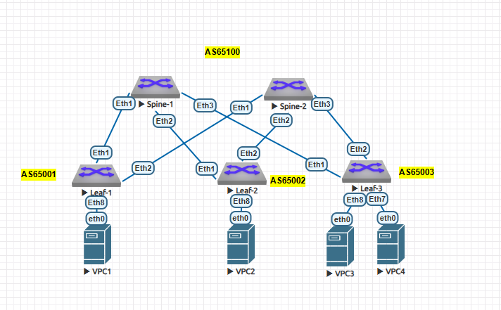

# Построение Underlay сети(BGP)

### Цели:
- ##### Настроить BGP для Underlay сети.

### Описание/Пошаговая инструкция выполнения домашнего задания:
- ##### Настроите BGP в Underlay сети, для IP связанности между всеми сетевыми устройствами. iBGP или eBGP - решать вам!
- ##### Зафиксируете в документации - план работы, адресное пространство, схему сети, конфигурацию устройств
- ##### Убедитесь в наличии IP связанности между устройствами в BGP домене




### Для IPv4
#### Адреса loopback-интерфейсов 
| Узел | Loopback-адрес |
|---------|--------|
| Spine-1 | 10.0.1.1 |
| Spine-2 | 10.0.2.2 |
| Leaf-1 | 10.0.0.1 |
| Leaf-2 | 10.0.0.2 |
| Leaf-3 | 10.0.0.3 |

##### Общая таблица связей:
| Связь | Подсеть | Адрес на Spine           | Адрес на Leaf           |
|---------------|---------------|---------------|---------------|
| Spine-1 <-> Leaf-1 | 172.16.1.0/30 | 172.16.1.1 | 172.16.1.2 |
| Spine-1 <-> Leaf-2 | 172.16.2.0/30 | 172.16.2.1 | 172.16.2.2 |
| Spine-1 <-> Leaf-3 | 172.16.3.0/30 | 172.16.3.1 | 172.16.3.2 |
| Spine-2 <-> Leaf-1 | 172.16.1.4/30 | 172.16.1.5 | 172.16.1.6 |
| Spine-2 <-> Leaf-2 | 172.16.2.4/30 | 172.16.2.5 | 172.16.2.6 |
| Spine-2 <-> Leaf-3 | 172.16.3.4/30 | 172.16.3.5 | 172.16.3.6 |

### Для IPv6
##### Адреса loopback-интерфейсов 
| Узел | Loopback-адрес |
|---------|--------|
| Spine-1	| 2001:db8:fab:ffff::1/128 |
| Spine-2       | 2001:db8:fab:ffff::2/128 |
| Leaf-1	| 2001:db8:fab:ffff::101/128 |
| Leaf-2	| 2001:db8:fab:ffff::102/128 |
| Leaf-3	| 2001:db8:fab:ffff::103/128 |

##### Общая таблица связей:
| Связь         | Подсеть                     | Адрес на Spine           | Адрес на Leaf           |
|---------------|-----------------------------|--------------------------|-------------------------|
| Spine1 <-> Leaf1  | 2001:db8:fab:1001::/64    | 2001:db8:fab:1001::1   | 2001:db8:fab:1001::2  |
| Spine1 <-> Leaf2  | 2001:db8:fab:1002::/64    | 2001:db8:fab:1002::1   | 2001:db8:fab:1002::2  |
| Spine1 <-> Leaf3  | 2001:db8:fab:1003::/64    | 2001:db8:fab:1003::1   | 2001:db8:fab:1003::2  |
| Spine2 <-> Leaf1  | 2001:db8:fab:2001::/64    | 2001:db8:fab:2001::1   | 2001:db8:fab:2001::2  |
| Spine2 <-> Leaf2  | 2001:db8:fab:2002::/64    | 2001:db8:fab:2002::1   | 2001:db8:fab:2002::2  |
| Spine2 <-> Leaf3  | 2001:db8:fab:2003::/64    | 2001:db8:fab:2003::1   | 2001:db8:fab:2003::2  |

##### Пример настроек:

Spine-1:
```cfg
peer-filter AS_FILTER
   10 match as-range 65000-65100 result accept
!
router bgp 65100
   router-id 10.0.1.1
   timers bgp 3 9
   bgp listen range 172.16.0.0/22 peer-group UNDERLAY peer-filter AS_FILTER
   neighbor L1_V6 peer group
   neighbor L1_V6 remote-as 65001
   neighbor L1_V6 out-delay 0
   neighbor L1_V6 bfd
   neighbor L2_V6 peer group
   neighbor L2_V6 remote-as 65002
   neighbor L2_V6 out-delay 0
   neighbor L2_V6 bfd
   neighbor L3_V6 peer group
   neighbor L3_V6 remote-as 65003
   neighbor L3_V6 out-delay 0
   neighbor L3_V6 bfd
   neighbor UNDERLAY peer group
   neighbor UNDERLAY out-delay 0
   neighbor UNDERLAY bfd
   neighbor UNDERLAY password 7 B1vgUQU1I6pc9Hs7T+HOPQ==
   neighbor 2001:db8:fab:1001::2 peer group L1_V6
   neighbor 2001:db8:fab:1002::2 peer group L2_V6
   neighbor 2001:db8:fab:1003::2 peer group L3_V6
   !
   address-family ipv4
      network 10.0.1.1/32
   !
   address-family ipv6
      neighbor 2001:db8:fab:1001::2 activate
      neighbor 2001:db8:fab:1002::2 activate
      neighbor 2001:db8:fab:1003::2 activate
      network 2001:db8:fab:ffff::1/128
!
```

Leaf-1:
```cfg
router bgp 65001
   router-id 10.0.0.1
   timers bgp 3 9
   maximum-paths 2 ecmp 2
   neighbor UNDERLAY peer group
   neighbor UNDERLAY remote-as 65100
   neighbor UNDERLAY out-delay 0
   neighbor UNDERLAY bfd
   neighbor UNDERLAY password 7 B1vgUQU1I6pc9Hs7T+HOPQ==
   neighbor UNDERLAY_V6 peer group
   neighbor UNDERLAY_V6 remote-as 65100
   neighbor UNDERLAY_V6 out-delay 0
   neighbor UNDERLAY_V6 bfd
   neighbor 172.16.1.1 peer group UNDERLAY
   neighbor 172.16.1.5 peer group UNDERLAY
   neighbor 2001:db8:fab:1001::1 peer group UNDERLAY_V6
   neighbor 2001:db8:fab:2001::1 peer group UNDERLAY_V6
   !
   address-family ipv4
      neighbor 172.16.1.1 activate
      neighbor 172.16.1.5 activate
      network 10.0.0.1/32
   !
   address-family ipv6
      neighbor 2001:db8:fab:1001::1 activate
      neighbor 2001:db8:fab:2001::1 activate
      network 2001:db8:fab:ffff::101/128
!
```

#### Проверка

RIB:
```cfg
Leaf-1(config-router-bgp-af)#show rib route ipv6
VRF: default, Protocol: connected
Codes: C - Connected, S - Static, P - Route Input
       B - BGP, O - OSPF, O3 - OSPF3, I - IS-IS
       > - Best Route, * - Unresolved Nexthop
       L - Part of a recursive route resolution loop
>C    2001:db8:fab:1001::/64 [0/1]
         via 2001:db8:fab:1001::2, Ethernet1
>C    2001:db8:fab:2001::/64 [0/1]
         via 2001:db8:fab:2001::2, Ethernet2
VRF: default, Protocol: bgp
Codes: C - Connected, S - Static, P - Route Input
       B - BGP, O - OSPF, O3 - OSPF3, I - IS-IS
       > - Best Route, * - Unresolved Nexthop
       L - Part of a recursive route resolution loop
>B    2001:db8:fab:ffff::1/128 [200/0]
         via 2001:db8:fab:1001::1 [0/1] 
            via Ethernet1, directly connected
>B    2001:db8:fab:ffff::102/128 [200/0]
         via 2001:db8:fab:2001::1 [0/1] 
            via Ethernet2, directly connected
         via 2001:db8:fab:1001::1 [0/1] 
            via Ethernet1, directly connected
>B    2001:db8:fab:ffff::103/128 [200/0]
         via 2001:db8:fab:1001::1 [0/1] 
            via Ethernet1, directly connected
         via 2001:db8:fab:2001::1 [0/1] 
            via Ethernet2, directly connected
Leaf-1(config-router-bgp-af)#show rib route 
% Incomplete command
Leaf-1(config-router-bgp-af)#show rib route ip
VRF: default, Protocol: connected
Codes: C - Connected, S - Static, P - Route Input
       B - BGP, O - OSPF, O3 - OSPF3, I - IS-IS
       > - Best Route, * - Unresolved Nexthop
       L - Part of a recursive route resolution loop
>C    172.16.1.0/30 [0/1]
         via 172.16.1.2, Ethernet1
>C    172.16.1.4/30 [0/1]
         via 172.16.1.6, Ethernet2
VRF: default, Protocol: bgp
Codes: C - Connected, S - Static, P - Route Input
       B - BGP, O - OSPF, O3 - OSPF3, I - IS-IS
       > - Best Route, * - Unresolved Nexthop
       L - Part of a recursive route resolution loop
>B    10.0.0.2/32 [200/0]
         via 172.16.1.1 [0/1] 
            via Ethernet1, directly connected
         via 172.16.1.5 [0/1] 
            via Ethernet2, directly connected
>B    10.0.0.3/32 [200/0]
         via 172.16.1.1 [0/1] 
            via Ethernet1, directly connected
         via 172.16.1.5 [0/1] 
            via Ethernet2, directly connected
>B    10.0.1.1/32 [200/0]
         via 172.16.1.1 [0/1] 
            via Ethernet1, directly connected
>B    10.0.2.2/32 [200/0]
         via 172.16.1.5 [0/1] 
            via Ethernet2, directly connected
```

FIB:
```cfg
Leaf-1(config-router-bgp-af)#sh ip ro

VRF: default
Codes: C - connected, S - static, K - kernel, 
       O - OSPF, IA - OSPF inter area, E1 - OSPF external type 1,
       E2 - OSPF external type 2, N1 - OSPF NSSA external type 1,
       N2 - OSPF NSSA external type2, B - Other BGP Routes,
       B I - iBGP, B E - eBGP, R - RIP, I L1 - IS-IS level 1,
       I L2 - IS-IS level 2, O3 - OSPFv3, A B - BGP Aggregate,
       A O - OSPF Summary, NG - Nexthop Group Static Route,
       V - VXLAN Control Service, M - Martian,
       DH - DHCP client installed default route,
       DP - Dynamic Policy Route, L - VRF Leaked,
       G  - gRIBI, RC - Route Cache Route

Gateway of last resort is not set

 C        10.0.0.1/32 is directly connected, Loopback0
 B E      10.0.0.2/32 [200/0] via 172.16.1.1, Ethernet1
                              via 172.16.1.5, Ethernet2
 B E      10.0.0.3/32 [200/0] via 172.16.1.1, Ethernet1
                              via 172.16.1.5, Ethernet2
 B E      10.0.1.1/32 [200/0] via 172.16.1.1, Ethernet1
 B E      10.0.2.2/32 [200/0] via 172.16.1.5, Ethernet2
 C        172.16.1.0/30 is directly connected, Ethernet1
 C        172.16.1.4/30 is directly connected, Ethernet2

Leaf-1(config-router-bgp-af)#sh ipv6 ro

VRF: default
Displaying 6 of 12 IPv6 routing table entries
Codes: C - connected, S - static, K - kernel, O3 - OSPFv3,
       B - Other BGP Routes, A B - BGP Aggregate, R - RIP,
       I L1 - IS-IS level 1, I L2 - IS-IS level 2, DH - DHCP,
       NG - Nexthop Group Static Route, M - Martian,
       DP - Dynamic Policy Route, L - VRF Leaked,
       RC - Route Cache Route

 C        2001:db8:fab:1001::/64 [0/1]
           via Ethernet1, directly connected
 C        2001:db8:fab:2001::/64 [0/1]
           via Ethernet2, directly connected
 B E      2001:db8:fab:ffff::1/128 [200/0]
           via 2001:db8:fab:1001::1, Ethernet1
 C        2001:db8:fab:ffff::101/128 [0/0]
           via Loopback0, directly connected
 B E      2001:db8:fab:ffff::102/128 [200/0]
           via 2001:db8:fab:1001::1, Ethernet1
           via 2001:db8:fab:2001::1, Ethernet2
 B E      2001:db8:fab:ffff::103/128 [200/0]
           via 2001:db8:fab:1001::1, Ethernet1
           via 2001:db8:fab:2001::1, Ethernet2
```

BFD:
```cfg
Leaf-1(config)#sh bfd peer
VRF name: default
-----------------
DstAddr        MyDisc    YourDisc  Interface/Transport    Type          LastUp 
---------- ----------- ----------- -------------------- ------- ---------------
172.16.1.1 1115310889  2481272801        Ethernet1(14)  normal  09/02/25 13:32 
172.16.1.5  999606829  2404660215        Ethernet2(15)  normal  09/02/25 13:32 

         LastDown            LastDiag    State
-------------------- ------------------- -----
   09/02/25 13:32       No Diagnostic       Up
   09/02/25 13:32       No Diagnostic       Up

DstAddr                     MyDisc     YourDisc   Interface/Transport     Type 
---------------------- ------------ ------------ --------------------- --------
2001:db8:fab:1001::1    3518941311   3407985201         Ethernet1(14)   normal 
2001:db8:fab:2001::1    3570048201    338429608         Ethernet2(15)   normal 

           LastUp             LastDown            LastDiag    State
-------------------- -------------------- ------------------- -----
   09/02/25 13:18       09/02/25 13:18       No Diagnostic       Up
   09/02/25 13:19       09/02/25 13:19       No Diagnostic       Up
```

BGP:
```cfg
Leaf-1(config)#sh ip bgp summary 
BGP summary information for VRF default
Router identifier 10.0.0.1, local AS number 65001
Neighbor Status Codes: m - Under maintenance
  Neighbor         V  AS           MsgRcvd   MsgSent  InQ OutQ  Up/Down State   PfxRcd PfxAcc
  172.16.1.1       4  65100           1319      1321    0    0 00:05:40 Estab   3      3
  172.16.1.5       4  65100           1323      1327    0    0 00:05:42 Estab   3      3
Leaf-1(config)#sh ipv6 bgp summary
BGP summary information for VRF default
Router identifier 10.0.0.1, local AS number 65001
Neighbor Status Codes: m - Under maintenance
  Neighbor         V  AS           MsgRcvd   MsgSent  InQ OutQ  Up/Down State   PfxRcd PfxAcc
  2001:db8:fab:1001::1 4  65100           1003      1019    0    0 00:19:55 Estab   3      3
  2001:db8:fab:2001::1 4  65100            936       950    0    0 00:18:53 Estab   3      3
Leaf-1(config)#

BGP neighbor is 172.16.1.1, remote AS 65100, external link
  BGP version 4, remote router ID 10.0.1.1, VRF default
  Inherits configuration from and member of peer-group UNDERLAY
  Negotiated BGP version 4
  Member of update group 2
  Last read 00:00:03, last write never
  Hold time is 9, keepalive interval is 3 seconds
  Configured hold time is 9, keepalive interval is 3 seconds
```

PING:
```cfg
--- 10.0.0.2 ping statistics ---
5 packets transmitted, 5 received, 0% packet loss, time 80ms
rtt min/avg/max/mdev = 16.684/17.670/18.599/0.756 ms, pipe 2, ipg/ewma 20.158/18.119 ms
Leaf-1(config-router-bgp-af)#ping 10.0.0.3 source 10.0.0.1
PING 10.0.0.3 (10.0.0.3) from 10.0.0.1 : 72(100) bytes of data.
80 bytes from 10.0.0.3: icmp_seq=1 ttl=63 time=18.8 ms
80 bytes from 10.0.0.3: icmp_seq=2 ttl=63 time=23.1 ms
80 bytes from 10.0.0.3: icmp_seq=3 ttl=63 time=16.9 ms
80 bytes from 10.0.0.3: icmp_seq=4 ttl=63 time=15.7 ms
80 bytes from 10.0.0.3: icmp_seq=5 ttl=63 time=14.6 ms

--- 10.0.0.3 ping statistics ---
5 packets transmitted, 5 received, 0% packet loss, time 76ms
rtt min/avg/max/mdev = 14.629/17.861/23.134/2.996 ms, pipe 2, ipg/ewma 19.031/18.183 ms
Leaf-1(config-router-bgp-af)#ping 10.0.1.1 source 10.0.0.1
PING 10.0.1.1 (10.0.1.1) from 10.0.0.1 : 72(100) bytes of data.
80 bytes from 10.0.1.1: icmp_seq=1 ttl=64 time=9.78 ms
80 bytes from 10.0.1.1: icmp_seq=2 ttl=64 time=12.1 ms
80 bytes from 10.0.1.1: icmp_seq=3 ttl=64 time=10.8 ms
80 bytes from 10.0.1.1: icmp_seq=4 ttl=64 time=9.18 ms
80 bytes from 10.0.1.1: icmp_seq=5 ttl=64 time=7.28 ms

--- 10.0.1.1 ping statistics ---
5 packets transmitted, 5 received, 0% packet loss, time 48ms
rtt min/avg/max/mdev = 7.288/9.847/12.148/1.630 ms, pipe 2, ipg/ewma 12.087/9.707 ms
Leaf-1(config-router-bgp-af)#ping 10.0.2.2 source 10.0.0.1
PING 10.0.2.2 (10.0.2.2) from 10.0.0.1 : 72(100) bytes of data.
80 bytes from 10.0.2.2: icmp_seq=1 ttl=64 time=26.7 ms
80 bytes from 10.0.2.2: icmp_seq=2 ttl=64 time=20.9 ms
80 bytes from 10.0.2.2: icmp_seq=3 ttl=64 time=20.8 ms
80 bytes from 10.0.2.2: icmp_seq=4 ttl=64 time=10.2 ms
80 bytes from 10.0.2.2: icmp_seq=5 ttl=64 time=8.30 ms

--- 10.0.2.2 ping statistics ---
5 packets transmitted, 5 received, 0% packet loss, time 72ms
rtt min/avg/max/mdev = 8.306/17.431/26.701/6.998 ms, pipe 3, ipg/ewma 18.173/21.570 ms
Leaf-1(config-router-bgp-af)#ping 10.0.2.2 source 10.0.0.1
PING 10.0.2.2 (10.0.2.2) from 10.0.0.1 : 72(100) bytes of data.
80 bytes from 10.0.2.2: icmp_seq=1 ttl=64 time=8.48 ms
80 bytes from 10.0.2.2: icmp_seq=2 ttl=64 time=6.87 ms
80 bytes from 10.0.2.2: icmp_seq=3 ttl=64 time=23.9 ms
80 bytes from 10.0.2.2: icmp_seq=4 ttl=64 time=19.7 ms
80 bytes from 10.0.2.2: icmp_seq=5 ttl=64 time=14.7 ms

--- 10.0.2.2 ping statistics ---
5 packets transmitted, 5 received, 0% packet loss, time 47ms
rtt min/avg/max/mdev = 6.877/14.766/23.979/6.496 ms, pipe 3, ipg/ewma 11.817/11.847 ms
Leaf-1(config-router-bgp-af)#


f::101(config-router-bgp-af)#ping 2001:db8:fab:ffff::2 source 2001:db8:fab:ffff: 
PING 2001:db8:fab:ffff::102(2001:db8:fab:ffff::102) from 2001:db8:fab:ffff::101 : 52 data bytes
60 bytes from 2001:db8:fab:ffff::102: icmp_seq=1 ttl=63 time=17.3 ms
60 bytes from 2001:db8:fab:ffff::102: icmp_seq=2 ttl=63 time=13.4 ms
60 bytes from 2001:db8:fab:ffff::102: icmp_seq=3 ttl=63 time=30.2 ms
60 bytes from 2001:db8:fab:ffff::102: icmp_seq=4 ttl=63 time=22.7 ms
60 bytes from 2001:db8:fab:ffff::102: icmp_seq=5 ttl=63 time=22.5 ms

--- 2001:db8:fab:ffff::102 ping statistics ---
5 packets transmitted, 5 received, 0% packet loss, ti103e 75ms
f::101n/avg/max/mdev = 13.450ping 2001:db8:fab:ffff::2 source 2001:db8:fab:ffff: 
PING 2001:db8:fab:ffff::103(2001:db8:fab:ffff::103) from 2001:db8:fab:ffff::101 : 52 data bytes
60 bytes from 2001:db8:fab:ffff::103: icmp_seq=1 ttl=63 time=19.4 ms
60 bytes from 2001:db8:fab:ffff::103: icmp_seq=2 ttl=63 time=21.3 ms
60 bytes from 2001:db8:fab:ffff::103: icmp_seq=3 ttl=63 time=16.9 ms
60 bytes from 2001:db8:fab:ffff::103: icmp_seq=4 ttl=63 time=16.1 ms
60 bytes from 2001:db8:fab:ffff::103: icmp_seq=5 ttl=63 time=20.2 ms

--- 2001:db8:fab:ffff::103 ping statistics ---
5 packets transmitted, 5 received, 0% packet loss, ti1e 68ms
:101min/avg/max/mdev = 16.182ping 2001:db8:fab:ffff::2 source 2001:db8:fab:ffff: 
PING 2001:db8:fab:ffff::1(2001:db8:fab:ffff::1) from 2001:db8:fab:ffff::101 : 52 data bytes
60 bytes from 2001:db8:fab:ffff::1: icmp_seq=1 ttl=64 time=8.64 ms
60 bytes from 2001:db8:fab:ffff::1: icmp_seq=2 ttl=64 time=10.4 ms
60 bytes from 2001:db8:fab:ffff::1: icmp_seq=3 ttl=64 time=9.07 ms
60 bytes from 2001:db8:fab:ffff::1: icmp_seq=4 ttl=64 time=7.72 ms
60 bytes from 2001:db8:fab:ffff::1: icmp_seq=5 ttl=64 time=11.2 ms

--- 2001:db8:fab:ffff::1 ping statistics ---
5 packets transmitted, 5 received, 0% packet loss, time 43ms
:101min/avg/max/mdev = 7.724/ping 2001:db8:fab:ffff::2 source 2001:db8:fab:ffff: 
PING 2001:db8:fab:ffff::2(2001:db8:fab:ffff::2) from 2001:db8:fab:ffff::101 : 52 data bytes
60 bytes from 2001:db8:fab:ffff::2: icmp_seq=1 ttl=64 time=7.76 ms
60 bytes from 2001:db8:fab:ffff::2: icmp_seq=2 ttl=64 time=11.4 ms
60 bytes from 2001:db8:fab:ffff::2: icmp_seq=3 ttl=64 time=24.1 ms
60 bytes from 2001:db8:fab:ffff::2: icmp_seq=4 ttl=64 time=21.2 ms
60 bytes from 2001:db8:fab:ffff::2: icmp_seq=5 ttl=64 time=18.3 ms

--- 2001:db8:fab:ffff::2 ping statistics ---
5 packets transmitted, 5 received, 0% packet loss, time 41ms
rtt min/avg/max/mdev = 7.769/16.587/24.148/6.107 ms, pipe 3, ipg/ewma 10.456/12.438 ms
```

### Конфиги устройств:
- [Spine-1](configs/S1.txt)
- [Spine-2](configs/S2.txt)
- [Leaf-1](configs/L1.txt)
- [Leaf-2](configs/L2.txt)
- [Leaf-3](configs/L3.txt)
