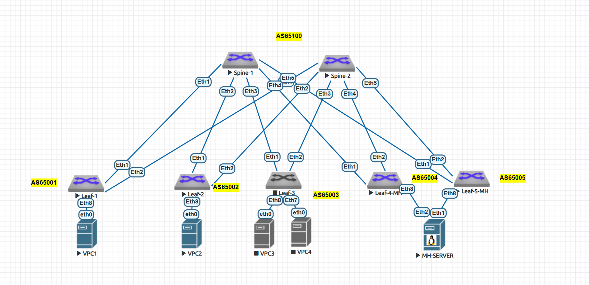

# VXLAN. Multihoming

### Цели:
- ##### Настроить отказоустойчивое подключение клиентов с использованием EVPN Multihoming.

### Описание/Пошаговая инструкция выполнения домашнего задания:
- ##### Подключите клиентов 2-я линками к различным Leaf
- ##### Настроите агрегированный канал со стороны клиента
- ##### Настроите multihoming для работы в Overlay сети. Если используете Cisco NXOS - vPC, если иной вендор - то ESI LAG (либо MC-LAG с поддержкой VXLAN)
- ##### Зафиксируете в документации - план работы, адресное пространство, схему сети, конфигурацию устройств
- ##### Опционально - протестировать отказоустойчивость - убедиться, что связнность не теряется при отключении одного из линков





К этой лабораторной работе UNDERLAY сеть была перестроена с исользованием eBGP af ipv4.

### Для IPv4
#### Адреса loopback-интерфейсов 
| Узел | Loopback-адрес |
|---------|--------|
| Spine-1 | 10.0.1.1 |
| Spine-2 | 10.0.2.2 |
| Leaf-1 | 10.0.0.1 |
| Leaf-2 | 10.0.0.2 |
| Leaf-3 | 10.0.0.3 |
| Leaf-4 | 10.0.0.4 |
| Leaf-5 | 10.0.0.5 |

##### Общая таблица связей:
| Связь | Подсеть | Адрес на Spine           | Адрес на Leaf           |
|---------------|---------------|---------------|---------------|
| Spine-1 <-> Leaf-1 | 172.16.1.0/30 | 172.16.1.1 | 172.16.1.2 |
| Spine-1 <-> Leaf-2 | 172.16.2.0/30 | 172.16.2.1 | 172.16.2.2 |
| Spine-1 <-> Leaf-3 | 172.16.3.0/30 | 172.16.3.1 | 172.16.3.2 |
| Spine-1 <-> Leaf-4 | 172.16.4.0/30 | 172.16.4.1 | 172.16.4.2 |
| Spine-1 <-> Leaf-5 | 172.16.4.0/30 | 172.16.5.1 | 172.16.5.2 |
| Spine-2 <-> Leaf-1 | 172.16.1.4/30 | 172.16.1.5 | 172.16.1.6 |
| Spine-2 <-> Leaf-2 | 172.16.2.4/30 | 172.16.2.5 | 172.16.2.6 |
| Spine-2 <-> Leaf-3 | 172.16.3.4/30 | 172.16.3.5 | 172.16.3.6 |
| Spine-2 <-> Leaf-4 | 172.16.4.4/30 | 172.16.4.5 | 172.16.4.6 |
| Spine-2 <-> Leaf-5 | 172.16.5.4/30 | 172.16.5.5 | 172.16.4.6 |

#### Адреса хостов
| Хост | Адрес | Шлюз | Vlan | VNI | 
|---------------|---------------|---------------|---------------|---------------|
| VPC1 | 192.168.10.1/24 | 192.168.10.254 | 10 | 10010 |
| VPC2 | 192.168.20.1/24 | 192.168.20.254 | 20 | 10020 |
| VPC3 | 192.168.30.1/24 | 192.168.30.254 | 30 | 10030 |
| VPC4 | 192.168.40.1/24 | 192.168.40.254 | 40 | 10040 |
| MH-SERVER | 192.168.50.1/24 | 192.168.50.254 | 50 | 10050 |

##### Пример настроек:


Пример настроек с Leaf-4-MH:
```cfg
interface Port-Channel1
   description to-MH-SERVER
   switchport trunk allowed vlan 50
   switchport mode trunk
   
   evpn ethernet-segment
      identifier 0000:0000:0000:0000:4501
      designated-forwarder election algorithm preference 90
      route-target import 00:00:00:00:45:01
   lacp system-id 0000.0000.4501
   spanning-tree portfast

interface Ethernet8
   description to-MH-SERVER-Eth1
   channel-group 1 mode active
   lacp timer fast

interface Vlan50
   vrf VRF1
   ip address virtual 192.168.50.254/24
```

Пример настроек со Leaf-4-MH:
```cfg
interface Port-Channel1
   description to-MH-SERVER
   switchport trunk allowed vlan 50
   switchport mode trunk
   
   evpn ethernet-segment
      identifier 0000:0000:0000:0000:4501
      designated-forwarder election algorithm preference 100
      route-target import 00:00:00:00:45:01
   lacp system-id 0000.0000.4501
   spanning-tree portfast

interface Ethernet8
   description to-MH-SERVER-Eth2
   channel-group 1 mode active
   lacp timer fast

interface Vlan50
   vrf VRF1
   ip address virtual 192.168.50.254/24
```


Пример настроек с MH-Server:
```cfg
interface Port-Channel1
   description "to L4-MH+L5-MH"
   switchport trunk allowed vlan 50
   switchport mode trunk
!
interface Ethernet1
   description "to-L5-MH.eth8"
   channel-group 1 mode active
!
interface Ethernet2
   description "to-L4-MH.eth8"
   channel-group 1 mode active
```

#### Проверка
```cfg
Leaf-1#sh bgp evpn
BGP routing table information for VRF default
Router identifier 10.0.0.1, local AS number 65001
Route status codes: * - valid, > - active, S - Stale, E - ECMP head, e - ECMP
                    c - Contributing to ECMP, % - Pending BGP convergence
Origin codes: i - IGP, e - EGP, ? - incomplete
AS Path Attributes: Or-ID - Originator ID, C-LST - Cluster List, LL Nexthop - Link Local Nexthop

          Network                Next Hop              Metric  LocPref Weight  Path
 * >Ec    RD: 10.0.0.4:50 auto-discovery 0 0000:0000:0000:0000:4501
                                 10.0.0.4              -       100     0       65100 65004 i
 *  ec    RD: 10.0.0.4:50 auto-discovery 0 0000:0000:0000:0000:4501
                                 10.0.0.4              -       100     0       65100 65004 i
 * >Ec    RD: 10.0.0.5:50 auto-discovery 0 0000:0000:0000:0000:4501
                                 10.0.0.5              -       100     0       65100 65005 i
 *  ec    RD: 10.0.0.5:50 auto-discovery 0 0000:0000:0000:0000:4501
                                 10.0.0.5              -       100     0       65100 65005 i
 * >Ec    RD: 10.0.0.4:1 auto-discovery 0000:0000:0000:0000:4501
                                 10.0.0.4              -       100     0       65100 65004 i
 *  ec    RD: 10.0.0.4:1 auto-discovery 0000:0000:0000:0000:4501
                                 10.0.0.4              -       100     0       65100 65004 i
 * >Ec    RD: 10.0.0.5:1 auto-discovery 0000:0000:0000:0000:4501
                                 10.0.0.5              -       100     0       65100 65005 i
 *  ec    RD: 10.0.0.5:1 auto-discovery 0000:0000:0000:0000:4501
                                 10.0.0.5              -       100     0       65100 65005 i
 * >      RD: 10.0.0.1:10 mac-ip 0050.7966.6806
                                 -                     -       -       0       i
 * >      RD: 10.0.0.1:10 mac-ip 0050.7966.6806 192.168.10.1
                                 -                     -       -       0       i
 * >Ec    RD: 10.0.0.5:50 mac-ip 5000.0045.abdf
                                 10.0.0.5              -       100     0       65100 65005 i
 *  ec    RD: 10.0.0.5:50 mac-ip 5000.0045.abdf
                                 10.0.0.5              -       100     0       65100 65005 i
 * >Ec    RD: 10.0.0.5:50 mac-ip 5000.0045.abdf 192.168.50.1
                                 10.0.0.5              -       100     0       65100 65005 i
 *  ec    RD: 10.0.0.5:50 mac-ip 5000.0045.abdf 192.168.50.1
                                 10.0.0.5              -       100     0       65100 65005 i
 * >      RD: 10.0.0.1:10 imet 10.0.0.1
                                 -                     -       -       0       i
 * >Ec    RD: 10.0.0.2:20 imet 10.0.0.2
                                 10.0.0.2              -       100     0       65100 65002 i
 *  ec    RD: 10.0.0.2:20 imet 10.0.0.2
                                 10.0.0.2              -       100     0       65100 65002 i
 * >Ec    RD: 10.0.0.4:50 imet 10.0.0.4
                                 10.0.0.4              -       100     0       65100 65004 i
 *  ec    RD: 10.0.0.4:50 imet 10.0.0.4
                                 10.0.0.4              -       100     0       65100 65004 i
 * >Ec    RD: 10.0.0.5:50 imet 10.0.0.5
                                 10.0.0.5              -       100     0       65100 65005 i
 *  ec    RD: 10.0.0.5:50 imet 10.0.0.5
                                 10.0.0.5              -       100     0       65100 65005 i
 * >Ec    RD: 10.0.0.4:1 ethernet-segment 0000:0000:0000:0000:4501 10.0.0.4
                                 10.0.0.4              -       100     0       65100 65004 i
 *  ec    RD: 10.0.0.4:1 ethernet-segment 0000:0000:0000:0000:4501 10.0.0.4
                                 10.0.0.4              -       100     0       65100 65004 i
 * >Ec    RD: 10.0.0.5:1 ethernet-segment 0000:0000:0000:0000:4501 10.0.0.5
                                 10.0.0.5              -       100     0       65100 65005 i
 *  ec    RD: 10.0.0.5:1 ethernet-segment 0000:0000:0000:0000:4501 10.0.0.5
                                 10.0.0.5              -       100     0       65100 65005 i


Leaf-4-MH(config-if-Po1)#sh bgp evpn route-type ethernet-segment
BGP routing table information for VRF default
Router identifier 10.0.0.4, local AS number 65004
Route status codes: * - valid, > - active, S - Stale, E - ECMP head, e - ECMP
                    c - Contributing to ECMP, % - Pending BGP convergence
Origin codes: i - IGP, e - EGP, ? - incomplete
AS Path Attributes: Or-ID - Originator ID, C-LST - Cluster List, LL Nexthop - Link Local Nexthop

          Network                Next Hop              Metric  LocPref Weight  Path
 * >      RD: 10.0.0.4:1 ethernet-segment 0000:0000:0000:0000:4501 10.0.0.4
                                 -                     -       -       0       i
 * >Ec    RD: 10.0.0.5:1 ethernet-segment 0000:0000:0000:0000:4501 10.0.0.5
                                 10.0.0.5              -       100     0       65100 65005 i
 *  ec    RD: 10.0.0.5:1 ethernet-segment 0000:0000:0000:0000:4501 10.0.0.5
                                 10.0.0.5              -       100     0       65100 65005 i


Leaf-5-MH(config-if-Et8)#sh bgp evpn route-type ethernet-segment
BGP routing table information for VRF default
Router identifier 10.0.0.5, local AS number 65005
Route status codes: * - valid, > - active, S - Stale, E - ECMP head, e - ECMP
                    c - Contributing to ECMP, % - Pending BGP convergence
Origin codes: i - IGP, e - EGP, ? - incomplete
AS Path Attributes: Or-ID - Originator ID, C-LST - Cluster List, LL Nexthop - Link Local Nexthop

          Network                Next Hop              Metric  LocPref Weight  Path
 * >Ec    RD: 10.0.0.4:1 ethernet-segment 0000:0000:0000:0000:4501 10.0.0.4
                                 10.0.0.4              -       100     0       65100 65004 i
 *  ec    RD: 10.0.0.4:1 ethernet-segment 0000:0000:0000:0000:4501 10.0.0.4
                                 10.0.0.4              -       100     0       65100 65004 i
 * >      RD: 10.0.0.5:1 ethernet-segment 0000:0000:0000:0000:4501 10.0.0.5
                                 -                     -       -       0       i

```

```cfg
VPC1> ping 192.168.50.1

84 bytes from 192.168.50.1 icmp_seq=1 ttl=62 time=34.648 ms
84 bytes from 192.168.50.1 icmp_seq=2 ttl=62 time=16.341 ms
84 bytes from 192.168.50.1 icmp_seq=3 ttl=62 time=19.985 ms
84 bytes from 192.168.50.1 icmp_seq=4 ttl=62 time=18.001 ms
84 bytes from 192.168.50.1 icmp_seq=5 ttl=62 time=15.954 ms

```

```cfg
MH-SERVER(config)#ping 192.168.10.1
PING 192.168.10.1 (192.168.10.1) 72(100) bytes of data.
80 bytes from 192.168.10.1: icmp_seq=1 ttl=62 time=18.3 ms
80 bytes from 192.168.10.1: icmp_seq=2 ttl=62 time=16.7 ms
80 bytes from 192.168.10.1: icmp_seq=3 ttl=62 time=13.7 ms
80 bytes from 192.168.10.1: icmp_seq=4 ttl=62 time=14.1 ms
80 bytes from 192.168.10.1: icmp_seq=5 ttl=62 time=13.3 ms

--- 192.168.10.1 ping statistics ---
5 packets transmitted, 5 received, 0% packet loss, time 65ms
rtt min/avg/max/mdev = 13.333/15.276/18.359/1.957 ms, pipe 2, ipg/ewma 16.471/16.698 ms
MH-SERVER(config)#
```

### Конфиги устройств:
- [Spine-1](configs/S1.txt)
- [Spine-2](configs/S2.txt)
- [Leaf-1](configs/L1.txt)
- [Leaf-2](configs/L2.txt)
- [Leaf-3](configs/L3.txt)
- [Leaf-4](configs/L4.txt)
- [Leaf-5](configs/L5.txt)
