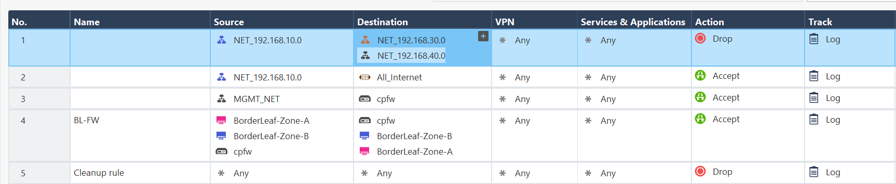

# VXLAN. Routing

### Цели:
- ##### Реализовать передачу суммарных префиксов через EVPN route-type 5.

### Описание/Пошаговая инструкция выполнения домашнего задания:
- ##### Разместить двух "клиентов" в разных VRF в рамках одной фабрики;
- ##### Настроить маршрутизацию между клиентами через внешнее устройство (граничный роутер\фаерволл\etc);


К этой лабораторной работе UNDERLAY сеть была перестроена с исользованием eBGP af ipv4.

### Для IPv4
#### Адреса loopback-интерфейсов 
| Узел | Loopback-адрес |
|---------|--------|
| Spine-1 | 10.0.1.1 |
| Spine-2 | 10.0.2.2 |
| Leaf-1 | 10.0.0.1 |
| Leaf-2 | 10.0.0.2 |
| Leaf-3 | 10.0.0.3 |
| Leaf-4 | 10.0.0.4 |


##### Общая таблица связей:
| Связь | Подсеть | Адрес на Spine           | Адрес на Leaf           |
|---------------|---------------|---------------|---------------|
| Spine-1 <-> Leaf-1 | 172.16.1.0/30 | 172.16.1.1 | 172.16.1.2 |
| Spine-1 <-> Leaf-2 | 172.16.2.0/30 | 172.16.2.1 | 172.16.2.2 |
| Spine-1 <-> Leaf-3 | 172.16.3.0/30 | 172.16.3.1 | 172.16.3.2 |
| Spine-1 <-> Border-Leaf | 172.16.4.0/30 | 172.16.4.1 | 172.16.4.2 |
| Spine-2 <-> Leaf-1 | 172.16.1.4/30 | 172.16.1.5 | 172.16.1.6 |
| Spine-2 <-> Leaf-2 | 172.16.2.4/30 | 172.16.2.5 | 172.16.2.6 |
| Spine-2 <-> Leaf-3 | 172.16.3.4/30 | 172.16.3.5 | 172.16.3.6 |
| Spine-2 <-> Border-Leaf| 172.16.4.4/30 | 172.16.4.5 | 172.16.4.6 |

#### Адреса хостов
| Хост | Адрес | Шлюз | Vlan | VNI | 
|---------------|---------------|---------------|---------------|---------------|
| VPC1 | 192.168.10.1/24 | 192.168.10.254 | 10 | 10010 |
| VPC2 | 192.168.20.1/24 | 192.168.20.254 | 20 | 10020 |
| VPC3 | 192.168.30.1/24 | 192.168.30.254 | 30 | 10030 |
| VPC4 | 192.168.40.1/24 | 192.168.40.254 | 40 | 10040 |

##### Интерфейсы шлюза Check Point 
| Интерфейс | Адрес | Комментарий
|---------------|---------------|---------------|
| eth1.10 | 192.168.10.254/24 | VLAN10 |
| eth1.20 | 192.168.20.254/24 | VLAN20 |
| eth1.30 | 192.168.30.254/24 | VLAN30 | 
| eth1.40 | 192.168.40.254/24 | VLAN40 | 
| eth1.500 | 172.16.100.1/30 | Линк для маршрутизации | 


##### Пример настроек:
Пример настроек с Leaf-1:
```cfg
hostname Leaf-1
!
spanning-tree mode mstp
!
vlan 10
   name NET10
!
vlan 20
   name NET20
!
vlan 30
   name NET30
!
vlan 40
   name NET40
!
vrf instance VRF-10
!
vrf instance VRF-20
!
vrf instance VRF-30
!
vrf instance VRF-40
!
vrf instance VRF-A
!
interface Ethernet1
   description "to-S1"
   mtu 9214
   no switchport
   ip address 172.16.1.2/30
   ipv6 address 2001:db8:fab:1001::2/64
!
interface Ethernet2
   description "to-S2"
   mtu 9214
   no switchport
   ip address 172.16.1.6/30
   ipv6 address 2001:db8:fab:2001::2/64
!
interface Ethernet3
!
interface Ethernet4
   mtu 9214
!
interface Ethernet5
   mtu 9214
!
interface Ethernet6
   mtu 9214
!
interface Ethernet7
   mtu 9214
!
interface Ethernet8
   mtu 9214
   switchport access vlan 10
!
interface Loopback0
   ip address 10.0.0.1/32
   ipv6 address 2001:db8:fab:ffff::101/128
   ip ospf area 0.0.0.1
   ipv6 ospf 1 area 0.0.0.1
!
interface Management1
!
interface Vxlan1
   vxlan source-interface Loopback0
   vxlan udp-port 4789
   vxlan vlan 10 vni 10010
   vxlan vlan 20 vni 10020
   vxlan vlan 30 vni 10030
   vxlan vlan 40 vni 10040
   vxlan vrf VRF-A vni 50000
   vxlan learn-restrict any
!
ip virtual-router mac-address de:ad:de:ad:de:ad
!
ip routing
no ip routing vrf VRF-10
no ip routing vrf VRF-20
no ip routing vrf VRF-30
no ip routing vrf VRF-40
ip routing vrf VRF-A
!
ipv6 unicast-routing
!
router bgp 65001
   router-id 10.0.0.1
   no bgp default ipv4-unicast
   timers bgp 3 9
   maximum-paths 2 ecmp 2
   neighbor EVPN peer group
   neighbor EVPN remote-as 65100
   neighbor EVPN next-hop-unchanged
   neighbor EVPN update-source Loopback0
   neighbor EVPN ebgp-multihop 3
   neighbor EVPN send-community extended
   neighbor UNDERLAY peer group
   neighbor UNDERLAY remote-as 65100
   neighbor 10.0.1.1 peer group EVPN
   neighbor 10.0.2.2 peer group EVPN
   neighbor 172.16.1.1 peer group UNDERLAY
   neighbor 172.16.1.5 peer group UNDERLAY
   !
   vlan 10
      rd 65001:10010
      route-target both 10010:10010
      redistribute learned
   !
   vlan 20
      rd 65001:10020
      route-target both 10020:10020
      redistribute learned
   !
   vlan 30
      rd 65001:10030
      route-target both 10030:10030
      redistribute learned
   !
   vlan 40
      rd 65001:10040
      route-target both 10040:10040
      redistribute learned
   !
   address-family evpn
      neighbor EVPN activate
   !
   address-family ipv4
      neighbor UNDERLAY activate
      network 10.0.0.1/32
   !
   vrf VRF-A
      rd 10.0.0.1:50000
      route-target import evpn 50000:50000
      route-target export evpn 50000:50000

```

Конфигурация Border-Leaf
```cfg
vlan 10
   name NET10
!
vlan 20
   name NET20
!
vlan 30
   name NET30
!
vlan 40
   name NET40
!
vlan 500
   name FIREWALL
!
vrf instance VRF-A
!
interface Port-Channel1
   lacp system-id 0000.0000.4501
!
interface Ethernet1
   description "to-S1"
   mtu 9214
   no switchport
   ip address 172.16.4.2/30
   ipv6 address 2001:db8:fab:1004::2/64
!
interface Ethernet2
   description "to-S2"
   mtu 9214
   no switchport
   ip address 172.16.4.6/30
   ipv6 address 2001:db8:fab:2004::2/64
!
interface Ethernet3
!
interface Ethernet4
!
interface Ethernet5
!
interface Ethernet6
!
interface Ethernet7
!
interface Ethernet8
   description "to-Firewall"
   switchport trunk allowed vlan 10,20,30,40,500
   switchport mode trunk
!
interface Loopback0
   ip address 10.0.0.4/32
   ipv6 address 2001:db8:fab:ffff::104/128
!
interface Management1
!
interface Vlan10
   vrf VRF-A
!
interface Vlan20
   vrf VRF-A
!
interface Vlan30
   vrf VRF-A
!
interface Vlan40
   vrf VRF-A
!
interface Vlan500
   vrf VRF-A
   ip address 172.16.100.2/30
!
interface Vxlan1
   vxlan source-interface Loopback0
   vxlan udp-port 4789
   vxlan vlan 10 vni 10010
   vxlan vlan 20 vni 10020
   vxlan vlan 30 vni 10030
   vxlan vlan 40 vni 10040
   vxlan vrf VRF-A vni 50000
   vxlan learn-restrict any
!
ip virtual-router mac-address de:ad:de:ad:de:ad
!
ip routing
ip routing vrf VRF-A
!
ipv6 unicast-routing
!
router bgp 65004
   router-id 10.0.0.4
   no bgp default ipv4-unicast
   timers bgp 3 9
   maximum-paths 2 ecmp 2
   neighbor EVPN peer group
   neighbor EVPN remote-as 65100
   neighbor EVPN next-hop-unchanged
   neighbor EVPN update-source Loopback0
   neighbor EVPN ebgp-multihop 3
   neighbor EVPN send-community extended
   neighbor UNDERLAY peer group
   neighbor UNDERLAY remote-as 65100
   neighbor 10.0.1.1 peer group EVPN
   neighbor 10.0.2.2 peer group EVPN
   neighbor 172.16.4.1 peer group UNDERLAY
   neighbor 172.16.4.5 peer group UNDERLAY
   !
   vlan 10
      rd 65004:10010
      route-target both 10010:10010
      redistribute learned
   !
   vlan 20
      rd 65004:10020
      route-target both 10020:10020
      redistribute learned
   !
   vlan 30
      rd 65004:10030
      route-target both 10030:10030
      redistribute learned
   !
   vlan 40
      rd 65004:10040
      route-target both 10040:10040
      redistribute learned
   !
   address-family evpn
      neighbor EVPN activate
   !
   address-family ipv4
      neighbor UNDERLAY activate
      network 10.0.0.4/32
   !
   vrf VRF-A
      rd 10.0.0.4:50000
      route-target import evpn 50000:50000
      route-target export evpn 50000:50000
      router-id 172.16.100.2
      timers bgp 3 9
      neighbor 172.16.100.1 remote-as 65500
      !
      address-family ipv4
         neighbor 172.16.100.1 activate
         redistribute connected

```

#### Проверка

Проверка маршрутов VRF-A на Border-Leaf:
```cfg
Border-Leaf#sh ip route vrf VRF-A

VRF: VRF-A
Codes: C - connected, S - static, K - kernel,
       O - OSPF, IA - OSPF inter area, E1 - OSPF external type 1,
       E2 - OSPF external type 2, N1 - OSPF NSSA external type 1,
       N2 - OSPF NSSA external type2, B - Other BGP Routes,
       B I - iBGP, B E - eBGP, R - RIP, I L1 - IS-IS level 1,
       I L2 - IS-IS level 2, O3 - OSPFv3, A B - BGP Aggregate,
       A O - OSPF Summary, NG - Nexthop Group Static Route,
       V - VXLAN Control Service, M - Martian,
       DH - DHCP client installed default route,
       DP - Dynamic Policy Route, L - VRF Leaked,
       G  - gRIBI, RC - Route Cache Route

Gateway of last resort:
 B E      0.0.0.0/0 [200/0] via 172.16.100.1, Vlan500

 C        172.16.100.0/30 is directly connected, Vlan500
 B E      192.168.10.0/24 [200/0] via 172.16.100.1, Vlan500
 B E      192.168.20.0/24 [200/0] via 172.16.100.1, Vlan500
 B E      192.168.30.0/24 [200/0] via 172.16.100.1, Vlan500
 B E      192.168.40.0/24 [200/0] via 172.16.100.1, Vlan500
```

Проверка маршрутов type-5
```cfg
Border-Leaf#show bgp evpn route-type ip-prefix ipv4
BGP routing table information for VRF default
Router identifier 10.0.0.4, local AS number 65004
Route status codes: * - valid, > - active, S - Stale, E - ECMP head, e - ECMP
                    c - Contributing to ECMP, % - Pending BGP convergence
Origin codes: i - IGP, e - EGP, ? - incomplete
AS Path Attributes: Or-ID - Originator ID, C-LST - Cluster List, LL Nexthop - Link Local Nexthop

          Network                Next Hop              Metric  LocPref Weight  Path
 * >      RD: 10.0.0.4:50000 ip-prefix 0.0.0.0/0
                                 -                     -       100     0       65500 i
 * >      RD: 10.0.0.4:50000 ip-prefix 172.16.100.0/30
                                 -                     -       -       0       i
 *        RD: 10.0.0.4:50000 ip-prefix 172.16.100.0/30
                                 -                     -       100     0       65500 i
 * >      RD: 10.0.0.4:50000 ip-prefix 192.168.10.0/24
                                 -                     -       100     0       65500 i
 * >      RD: 10.0.0.4:50000 ip-prefix 192.168.20.0/24
                                 -                     -       100     0       65500 i
 * >      RD: 10.0.0.4:50000 ip-prefix 192.168.30.0/24
                                 -                     -       100     0       65500 i
 * >      RD: 10.0.0.4:50000 ip-prefix 192.168.40.0/24
                                 -                     -       100     0       65500 i
 * >      RD: 10.0.0.4:50000 ip-prefix 192.168.88.0/24
                                 -                     -       100     0       65500 i
```


Правила на Check Point:

Пинг адреса в интернете, и хостов. Как видно адрес в интернете пингуется, как и адрес 192.168.20.1, потому что это разрешено правилами. А вот взаимодействие с хостами 192.168.30.1 и 192.168.40.1 в явном виде запрещено, поэтому пинг и не проходит.

```cfg
VPC1> ping 8.8.8.8

84 bytes from 8.8.8.8 icmp_seq=1 ttl=109 time=34.190 ms
84 bytes from 8.8.8.8 icmp_seq=2 ttl=109 time=20.168 ms
84 bytes from 8.8.8.8 icmp_seq=3 ttl=109 time=20.933 ms
84 bytes from 8.8.8.8 icmp_seq=4 ttl=109 time=19.784 ms
84 bytes from 8.8.8.8 icmp_seq=5 ttl=109 time=36.693 ms

VPC1> ping 192.168.30.1

192.168.30.1 icmp_seq=1 timeout
192.168.30.1 icmp_seq=2 timeout
192.168.30.1 icmp_seq=3 timeout
192.168.30.1 icmp_seq=4 timeout
192.168.30.1 icmp_seq=5 timeout

VPC1> ping 192.168.40.1

192.168.40.1 icmp_seq=1 timeout
192.168.40.1 icmp_seq=2 timeout
192.168.40.1 icmp_seq=3 timeout
192.168.40.1 icmp_seq=4 timeout
192.168.40.1 icmp_seq=5 timeout

VPC1> ping 192.168.20.1

84 bytes from 192.168.20.1 icmp_seq=1 ttl=63 time=54.261 ms
84 bytes from 192.168.20.1 icmp_seq=2 ttl=63 time=24.695 ms
84 bytes from 192.168.20.1 icmp_seq=3 ttl=63 time=22.588 ms
84 bytes from 192.168.20.1 icmp_seq=4 ttl=63 time=21.806 ms
84 bytes from 192.168.20.1 icmp_seq=5 ttl=63 time=23.295 ms
```


### Конфиги устройств:
- [Spine-1](configs/S1.txt)
- [Spine-2](configs/S2.txt)
- [Leaf-1](configs/L1.txt)
- [Leaf-2](configs/L2.txt)
- [Leaf-3](configs/L3.txt)
- [Border-Leaf](configs/Border-Leaf.txt)
- [Check Point Firewall](configs/Check-Point-Firewall.txt)
